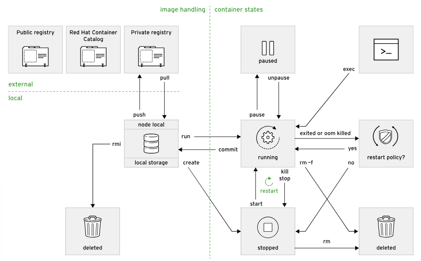
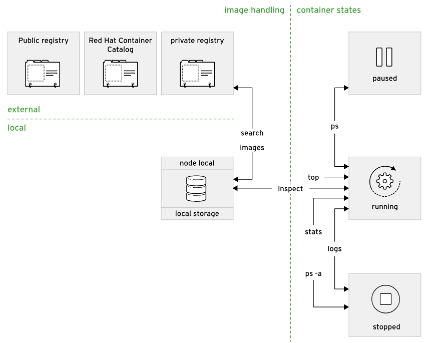

# redhat introduction to containers with podman DO188 notes

- https://www.redhat.com/en/topics/containers
- https://opencontainers.org/about/overview/

## Lifecycle of Applications in Red Hat OpenShift Container Platform

### Kubernetes Overview

- https://kubernetes.io/docs/home/

Kubernetes is an orchestration service that simplifies the deployment, management, and scaling of containerized applications. It manages complex pools of resources, such as CPU, RAM, storage, and networking. Kubernetes provides high uptime and fault tolerance for containerized application deployments, removing the concern that developers might have regarding how their applications use resources.

The smallest manageable unit in Kubernetes is a pod, which represents a single application and consists of one or more containers, including storage resources and an IP address.

### Red Hat OpenShift Container Platform Overview

- https://docs.redhat.com/en/documentation/openshift_container_platform/4.18

Red Hat OpenShift Container Platform (RHOCP) is a set of modular components and services that are built on top of the Kubernetes container infrastructure. RHOCP adds capabilities to a production platform, such as remote management, multitenancy, increased security, monitoring and auditing, application lifecycle management, and self-service interfaces for developers.

- Starts with the definition of a pod and the containers that it is composed of, which contain the application.
- Pods are assigned to a healthy node.
- Pods run until their containers exit.
- Pods and their containers are removed from the node.

## podman

- https://podman.io/
- https://docs.podman.io/en/stable/
- https://podman-desktop.io/docs/intro

```
podman run --rm -d --name some-container-name \
    -p host-port:container-port \
    --net some-network,some-other-network
    -e SOMEVAR='some value' \
    path-to-image:version \
    command

podman -v

podman pull image-path:version

podman images

podman ps --all --format=json
```

### podman network

- https://github.com/podman-container-tools/podman/blob/main/docs/tutorials/basic_networking.md

DNS hostname of a container is its container name. So for ```--name some-name```, the host name will be ```some-name```

```
podman network create some-network

podman run ... --net some-network ...

podman inspect my-app \
  -f '{{.NetworkSettings.Networks.apps.IPAddress}}'
```

### port forwarding

Without a host specified, the container is assigned the broadcast address (0.0.0.0). This means that the container is accessible from all networks on the host machine. To publish a container to a specific host and to limit the networks it is accessible from, use the following form, 

```
podman run -p 127.0.0.1:host-port:container-port my-app
```

```
podman port --all
```

## container layers
```
ephemeral storage layer (RW)
image layer n (RO)
...
image layer 1 (RO)
image layer 0 (RO)
```

## start processes in containers

### Execute command(s) in a running container
```
podman exec [options] container-name [command...]
```

### open an iteractive session in a running container
```
podman exec -it container-name /bin/bash
```

## copy files in and out of containers
```
podman cp [options] [container:]source/path [container:]/destination/path

podman cp my-container:/tmp/logs ~/logs
podman cp nginx.conf ngnix-container:/etc/nginx
podman cp nginx-test:/etc/nginx/nginx.conf nginx-actual:/etc/nginx
```

## container lifecycle





```
podman ps --all

podman inspect container-name|container-id
podman inspect --format='{{...}}' ...  \\ see Go templating language link below

# send SIGTERM signal to container
podman stop container-name|container-id
podman stop --all

# send SIGKILL signal to container
podman kill container-name|container-id

# send SIGSTOP signal to container
podman pause ...
podman unpause ...

podman restart ...

# remove a stopped container
podman rm --force|-f ...
podman rm --all
```

- https://docs.podman.io/en/v5.2.2/markdown/podman-inspect.1.html
- https://pkg.go.dev/text/template

## Quadlets

In a traditional environment, administrators configure applications such as web servers or databases to start at boot time, and run indefinitely as a systemd service. This is especially important in edge devices because containers need full lifecycle management, but a full orchestration solution might consume excessive computing resources.

Systemd is a system and service management tool for Linux operating systems. Systemd uses service unit files to start and stop applications, or to enable them to start at boot time. Typically, an administrator manages these applications with the systemctl command.

Quadlets bridge the integration between systemd and containers by enabling the creation of declarative configuration to manage containers as system applications.

### The Quadlet Unit File

- https://docs.podman.io/en/v5.2.2/markdown/podman-systemd.unit.5.html

A Quadlet unit file is a systemd unit file, but with Podman-specific sections, such as ```[Container]```, to specify the Podman command arguments.

The Quadlet files use the ```<serviceName>.container``` naming pattern. When you install Podman, it registers a systemd-generator tool that looks for files in the following directories to generate systemd unit files.

```	
$XDG_CONFIG_HOME/containers/systemd/ or ~/.config/containers/systemd/
/etc/containers/systemd/users/$(UID)
/etc/containers/systemd/users/
```

```
# enable a Quadlet systemd unit for the current user
systemctl --user daemon-reload

# manage a user Quadlet service
systemctl --user start|stop|status some-service-name.service

# When you use the --user option, systemd starts the service when you log in, and stops it when you log out. You can avoid stopping your service when you log out by running the loginctl enable-linger command.

loginctl enable-linger
```

## Container registries

### Red Hat registry

- https://catlog.redhat.com
- https://catlog.redhat.com/software/containers/explore

```
# not authenticated
registry.access.redhat.com

# authenticated
registry.redhat.io
```

Red Hat UBIs are Open Container Initiative (OCI) compliant enterprise grade container images that provide the base operating system layer for your containerized applications. UBIs include a subset of Red Hat Enterprise Linux (RHEL) components. UBIs can additionally provide a set of pre-built language runtimes. UBIs are freely distributable, and you can use UBIs on both Red Hat and non-Red Hat platforms or container registries.

You do not need a Red Hat subscription to use or distribute UBI-based images. However, Red Hat only provides full support for containers built on UBI if the containers are deployed to a Red Hat platform, such as Red Hat OpenShift Container Platform (RHOCP) or RHEL.

### quay.io

- https://quay.io

Although the Red Hat Registry only stores images from Red Hat and certified providers, you can use the Quay.io registry to store your custom images. Storing public images in Quay.io is free, and paying customers receive further benefits, such as private repositories. Developers can also deploy an on-premise Quay instance, which you can use to set up an image registry on your infrastructure.

To log in to Quay.io, you can use your Red Hat developer account.

### manage registries with podman

- https://www.redhat.com/en/blog/manage-container-registries

```
podman pull registry.url/namespace/image-repository:image-tag

podman pull registry.ocp4.example.com:8443/ubi9/ubi-minimal:9.5
```

If you do not provide the registry URL, then Podman uses the ```~/.config/containers/registries.conf``` or ```/etc/containers/registries.conf``` files to search other container registries that might contain the image name. These files contain registries that Podman searches to find the image, in order of preference. The user-defined ```~/.config/containers/registries.conf``` file overrides the global ```/etc/containers/registries.conf``` file.

Red Hat recommends that you always use a fully qualified container image name to avoid using images from unintended container registries. For example, depending on your Podman configuration, the ```ubi9/ubi-minimal:9.5``` container image might resolve to a potentially unsupported or malicious ```docker.io/library/ubi9/ubi-minimal:9.5``` container image.

If Podman matches the short image name in several registries, then it prompts the user to select which to use.

### manage registries with skopeo

- https://github.com/podman-container-tools/skopeo
- https://www.redhat.com/en/blog/manage-container-registries
- https://developers.redhat.com/articles/2025/09/24/skopeo-unsung-hero-linux-container-tools

Skopeo can inspect remote images or transfer images between registries without using local storage. The skopeo command uses the transport:image format - docker, oci, dir,...

```
skopeo inspect docker://registry.access.redhat.com/ubi9/nodejs-18
skopeo copy docker://registry.access.redhat.com/ubi9/nodejs-18 docker://quay.io/myuser/nodejs-18
skopeo copy docker://registry.access.redhat.com/ubi9/nodejs-18 dir:/var/lib/images/nodejs-18
```

### manage registry credentials with podman

Some registries require users to authenticate, such as the registry.redhat.io registry. Authenticate your calls by executing the podman login command.

```
podman login registry.redhat.io
...
podman pull registry.redhat.io/rhel8/httpd-24
```

Podman stores the credentials in the ```${XDG_RUNTIME_DIR}/containers/auth.json``` file, where the ```${XDG_RUNTIME_DIR}``` refers to a directory specific to the current user. The credentials are encoded in the base64 format

```
cat ${XDG_RUNTIME_DIR}/containers/auth.json
echo -n dXN...XIy | base64 -d
```

Skopeo uses the same ```${XDG_RUNTIME_DIR}/containers/auth.json``` file to access authentication details for each registry.

## managing images

### Image Versioning and Tags

- https://docs.podman.io/en/stable/markdown/podman-tag.1.html

One way to version images relative to their packaged software product is to use semantic versioning. Semantic version numbers form a string with the format MAJOR.MINOR.PATCH meaning:

```
MAJOR: backward incompatible changes
MINOR: backward compatible changes
PATCH: bug fixes
```

Because versioning has no enforced structure, it is up to the image maintainers to follow good versioning practices.

Image versions can be used in the image name or in the image tag. An image tag is a string that you specify after the image name. Also, the same image can have multiple tags.

```
podman image tag simple-server simple-server:0.1
```

### search for images

To search for images in different image registries, use a web browser to go to the registry URL and use the web UI.

Alternatively, use the podman search command to search for images in all the registries present in the ```unqualified-search-registries``` list in your ```registries.conf``` file. This enables you to search multiple registries.

```
podman search nginx
podman search registry.example.com:8443/developer/
```

Add private registries to the default search list by including them in the ```unqualified-search-registries``` list in the ```~/.config/containers/registries.conf``` file.

```
unqualified-search-registries = ['registry.example.com:8443', 'registry.redhat.io', 'docker.io']
```

### building images

You can also build an image from a Containerfile, which describes the steps used to build an image. Run the ```podman build --file CONTAINERFILE --tag IMAGE_REFERENCE``` to build a container image.

For example, to build an image that you can later push to Red Hat Quay.io, execute the following command:

```
podman build --file Containerfile --tag quay.io/YOUR_QUAY_USER/IMAGE_NAME:TAG
```

### pushing images

After you build an image, share it by pushing it to a remote registry. To push an image, you must be logged in to the registry. Run the ```podman login REGISTRY``` to log in to the specified registry. Then, you can use the ```podman push IMAGE``` command to push a local image to the remote registry.

```
podman push quay.io/YOUR_QUAY_USER/IMAGE_NAME:TAG
```

### inspecting images

```
podman image inspect registry.redhat.io/rhel8/rariadb-103:1 --format='{{...}}'
```

### removing images

```
podman image rm -f REGISTRY/NAMESPACE/IMAGE_NAME:TAG

podman image rm --all

# remove dangling images
podman image prune

# remove dangling and unused images
podman image prune -a
```

### export and import containers

The podman export command exports a container to a tar file on your local machine. This command creates a snapshot of an existing container, referenced by the CONTAINER_ID. You can use the podman export command to create snapshots for containers as a backup method, __but note that Podman squashes the image layers into a single layer and removes the metadata from the image__.

```
podman export --output mytarfile.tar container-id

podman import mytarfile.tar image-name:tag
```

### export and import container IMAGES

To export and import a container image you can use the podman save and podman load commands respectively. The podman save command, unlike podman export, __keeps the original image layers and metadata__, such as the image history or labels.

```
podman save --output my-container-image.tar registry/namespace/image-name:tag

podman load --input my-container-image.tar
```

## Containerfile

- https://github.com/containers/common/blob/main/docs/Containerfile.5.md
- https://developers.redhat.com/articles/2021/11/11/best-practices-building-images-pass-red-hat-container-certification
- https://opensource.com/article/21/8/container-image

```
podman build -t image-name:tag -f ./Containerfile
```

Each RUN, COPY and ADD create a copy-on-write (COW) layer. Chain these if you can

```
# This is a comment line
FROM        registry.redhat.io/ubi8/ubi:8.6

LABEL       description="This is a custom httpd container image"

RUN         yum install -y httpd && \
            yum install -y something-else

ENV         SERVER_PORT=80

EXPOSE      ${SERVER_PORT}

ENV         LogLevel "info" \
            MY_ENV="some value"

ADD         http://someserver.com/filename.pdf /var/www/html

COPY        ./src/   /var/www/html/

USER        apache

ENTRYPOINT  ["/usr/sbin/httpd"]
CMD         ["-D", "FOREGROUND"]
```

```
FROM .../ubi9/nodejs-22-minimal:1

LABEL org.opencontainers.image.authors="..."
LABEL com.example.version="0.0.1"

ENV SERVER_PORT=3000
ENV NODE_ENV="production"

EXPOSE ${SERVER_PORT}

WORKDIR /path/inside/the/container
USER 1000

COPY . .

RUN npm install

CMD npm start
```

### ARG and ENV
```
podman build ... --build-arg ARG_1="some value"
podman run ... -e KEY_2="another value" ...

# ARGs are passed into the build-time environment

ARG VERSION="1.1.0" \
   ARG_1="default value"

# ENVs are passed into the container's runtime environment

ENV VERSION=${VERSION} \
    KEY_1=${MY_KEY} \
    KEY_2="default value"
    
RUN ... some-command -Dkey2=${KEY_2} ...

System.getenv("KEY_1");
System.getenv("KEY_2");
System.getProperty("key2");

@ConfigProperty(name = "KEY_1")
@ConfigProperty(name = "KEY_2")
@ConfigProperty(name = "key2")
```

Use environment variables when:
- You want runtime overrides (podman run -e KEY=value)
- You want platform-level config (Kubernetes ConfigMap, Podman env)
- You want 12‑factor style configuration
- You want to avoid baking values into the image

Use system properties when:
- You want to configure Java libraries or frameworks (MicroProfile, Quarkus, Spring Boot)
- You want to override defaults inside the JVM
- You want fine-grained control over Java behaviour
- You want to map env vars → system properties

```
ENV APP_PORT=8080
ENTRYPOINT ["java", "-Dapp.port=${APP_PORT}", "-jar", "/app/app.jar"]

This gives you
- externalised config (ENV)
- Java-native access (System.getProperties("app.port"))
- cloud-native Java framework (@ConfigProperty(name = "APP_PORT"))
- runtime overrides (podman run -e APP_PORT=9090)
```

Build‑time configuration (ARG → ENV)
```
ARG ARG_1="default value"
ENV KEY_1=${ARG_1}

podman build --build-arg ARG_1="some value" .
```

Result
- ARG_1 exists only during the build.
- KEY_1 is baked into the final image.
- At runtime, the container sees ```KEY_1=some value```

This is the correct pattern when you want:
- a default baked into the image
- the ability to override it at build time
- a stable runtime value that does not change unless you rebuild

This is ideal for things like:
- build‑time feature flags
- selecting dependencies
- embedding version metadata
- non‑secret configuration that should be fixed per image

Runtime configuration (ENV → runtime override)
```
ENV KEY_2="default value"

podman run -e KEY_2="another value" myimage
```

Result
- KEY_2 defaults to "default value"
- You can override it at runtime
- No rebuild required

This is ideal for:
- ports
- log levels
- database URLs
- anything environment‑specific
- anything secret (passed via -e, not baked into the image)

### VOLUME
```
# create an anonymous volume that exists for the life of the container

VOLUME /var/lib/pgsql/data
```

### ENTRYPOINT and CMD
```
FROM .../ubi8/ubi-minimal:8.5

USER 1000

# arguments passed to the container are appended to the entry point
ENTRYPOINT ["echo", "Hello"]

# if no arguments are passed to the container, use the default arguments
ENTRYPOINT ["echo", "Hello"]
CMD ["Red Hat"]

# arguments passed to the container override this
CMD ["echo", "Hello", "Red Hat"]

# array/exec form
# - direct exec
# - no shell involved
# - process becomes PID 1
# - signals go directly to the process
# - arguments behave predictably
# - ENTRYPOINT and CMD combine correctly
ENTRYPOINT ["executable", "arg1"]

# string/shell form
# - runs as /bin/sh -c "executable arg1"
# - shell-form ENTRYPOINT ignores CMD entirely
# - shell expansion occurs *** the ONLY REASON we would use string form
#   - $VAR expansion
#   - $(command) substitution
#   - pipes (|)
#   - redirects (>, >>)
#   - && / || chaining
#   - globbing (*.log)
# - shell becomes PID 1, executable a child process
# - signals might not reach the executable process
ENTRYPOINT executable arg1
```

### Podman secrets

```
# from a file

echo "R3d4ht123" > dbsecretfile
podman secret create dbsecret dbsecretfile

# from STDIN (the hyphen (-) tells podman to read from STDIN)

printf "R3d4ht123" | podman secret create dbsecret2 -

podman secret create ... --driver=file|pass|shell

podman secret ls
podman secret rm secret-name

podman run ... --secret secret-name ...
podman run ... --secret secret-name,type=env,target=DB_SECRET ...
```

```
printf "super-secret-password" | podman secret create dbpassword -

# mounts the secret file to the secrets mount point

podman run --secret dbpassword my-quarkus-app

# Containerfile
# - maps the secrets mount point to the system env variable

FROM quay.io/quarkus/quarkus-micro-image:2.16
WORKDIR /app
COPY target/quarkus-app/ /app/
ENV QUARKUS_DATASOURCE_PASSWORD_FILE=/run/secrets/dbpassword
ENTRYPOINT ["java", "-jar", "/app/quarkus-run.jar"]

# application.properties
# - reads the secret file and maps the value to the quarkus environment variable

quarkus.datasource.username=dbuser
quarkus.datasource.password-file=${QUARKUS_DATASOURCE_PASSWORD_FILE}

# code
# - maps the quarkus environment variable to a field

@ApplicationScoped
public class DbPasswordConfig {
    @ConfigProperty(name = "quarkus.datasource.password")
    String dbPassword;
    ...
}
```

### multi-stage build
```
# First stage
FROM registry.access.redhat.com/ubi8/nodejs-14:1 as builder
COPY ./ /opt/app-root/src/
RUN npm install
RUN npm run build

# Second stage
FROM registry.access.redhat.com/ubi8/nginx-120
COPY --from=builder /opt/app-root/src/ /usr/share/nginx/html
...
```


# remote container development with visual studio code and podman
- https://developers.redhat.com/articles/2023/02/14/remote-container-development-vs-code-and-podman#


Building an image
- https://docs.podman.io/en/latest/markdown/podman-build.1.html
- https://github.com/containers/common/blob/main/docs/Containerfile.5.md


# POSTGRESQL
- https://github.com/docker-library/docs/blob/master/postgres/README.md
- https://hub.docker.com/_/postgres
- https://www.postgresql.org/docs/current/


mkdir /home/core/postgres-data

podman ... -v /home/core/postgres-data:/var/lib/postgresql/data:z


export IMAGE_NAME=postgres:bookworm
export CONTAINER_NAME=postgres_one
export DATA_PATH=/home/core/postgres-data
export NETWORK_NAME=podman
export POSTGRES_USER=postgres
export POSTGRES_PASSWORD=postgres

# NOTE the ":Z" on the volume mapping. See,
- https://web.archive.org/web/20190728100417/https://www.projectatomic.io/blog/2015/06/using-volumes-with-docker-can-cause-problems-with-selinux/
- https://stackoverflow.com/questions/24288616/permission-denied-on-accessing-host-directory-in-docker
- https://github.com/docker-library/postgres/issues/116

podman run --name ${CONTAINER_NAME} --network ${NETWORK_NAME} -e POSTGRES_PASSWORD=${POSTGRES_PASSWORD} -e POSTGRES_USER=${POSTGRES_USER} -e PGDATA=/var/lib/postgresql/data/pgdata -v ${DATA_PATH}:/var/lib/postgresql/data:Z  -d ${IMAGE_NAME}

podman logs ${CONTAINER_NAME}

export CONTAINER_IP=$(podman inspect -f '{{range .NetworkSettings.Networks}}{{.IPAddress}}{{end}}' ${CONTAINER_NAME})

podman run -it --rm --network ${NETWORK_NAME} ${IMAGE_NAME} psql -h ${CONTAINER_IP} -U ${POSTGRES_USER}


podman stop ${CONTAINER_NAME}
podman rm ${CONTAINER_NAME}


podman run -i --rm postgres:bookworm cat /usr/share/postgresql/postgresql.conf.sample | less

/^[a-zA-Z]