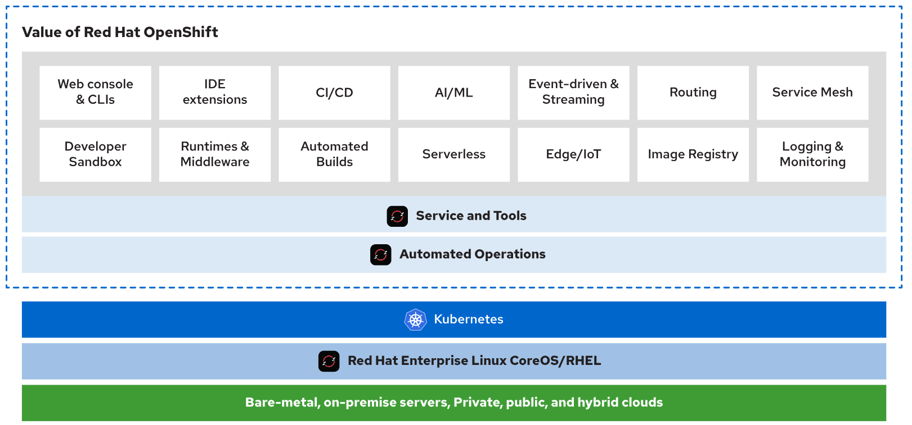
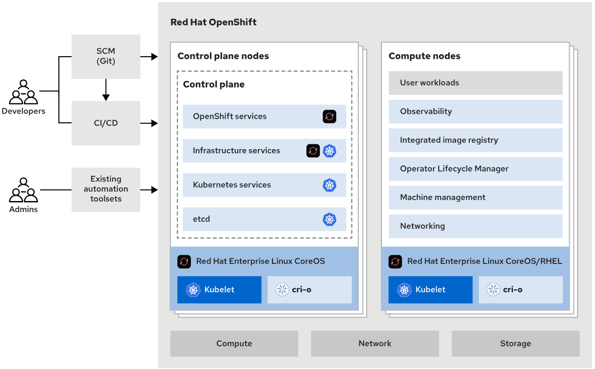
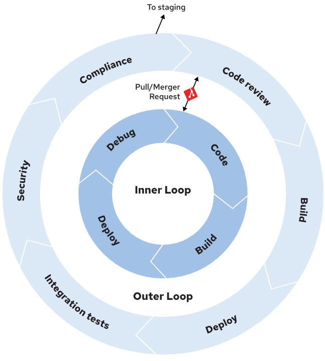

# redhat openshift developer 2 - building and deploying cloud-native applications DO288

```
uptime

ssh lab@utility
./wait.sh
```





## kubernetes concepts

#### Pods
A Pod is a collection of containers that share the same storage and network. Pods share the context by using Linux namespaces, cgroups, and other isolation technologies.

Each container in a pod usually contains applications that are more or less logically coupled.

#### ReplicaSet
The ReplicaSet object indicates the number of pods that are available to attend a request. This object also ties all the pods replicas together so you can operate on them at the same time.

#### Deployments
A Deployment contains the desired state of an application's pods and uses a ReplicaSet to achieve this desired state. Some changes in the application's state can be: creating pods, declaring a new state of pods, changing the number of pods, or rolling back to a previous Deployment revision.

#### Service
A Kubernetes Service exposes a set of pods over a network. This abstraction allows internal or external clients of the application running on said pods to connect to them regardless of the actual state of the replicas or varying network IPs.

#### Ingress
An Ingress exposes services inside the cluster to outside clients by using HTTP or HTTPS. A service ingress can also provide external URLs, load balancing, name-based virtual hosting, or SSL/TLS termination.

#### Namespace
A Namespace can enable you to isolate resources, encapsulate objects under a unique name, and provide resource quotas.

#### Custom Resource
Custom Resource (CR) allows extending the Kubernetes API. Custom resources represent entities other than the default ones in Kubernetes. Additionally, Custom resources interact with other cluster objects, regardless of whether those other objects are default or custom.

#### Operator
An Operator is a custom Kubernetes controller that uses custom resources to deploy and manage applications. It takes high-level user configuration and acts to make the cluster match the desired state.

#### Service Account
A Service Account is a special kind of account that does not correspond to an actual user, but it is used internally by cluster tools. It is useful for pods to connect to objects in the cluster, such as CI/CD pipelines, secrets, or external resources (outside of the namespace or the cluster).

#### Storage Class
A Storage Class is a name that identifies a particular kind of storage defined by the cluster administrator. A storage class also defines its characteristics, such as backup policies, service level quality, or any other specification the administrator might choose.

#### Persistent Volume
A Persistent Volume (PV), is a persistence storage unit offered by the cluster, independent of cluster nodes. This object holds information regarding the size, type, or ability to share storage.

#### Persistent Volume Claim
Users claim the storage that a PV offers by using a Persistent Volume Claim (PVC). A PVC is a request to access a specific kind of storage of the required size. After acquiring the PVC, the storage is attached to the pods claiming it.

## Red Hat OpenShift Extends Kubernetes
In the following list, you can find how Red Hat OpenShift extends the basic functionality of Kubernetes:

#### Build
A Build is the generic process of taking an input source, such as the source code of an application, and producing a usable resource as the output, such as a runnable image.

#### BuildConfig
An object that defines a build process. A build object requires, at least, the source input of the build, the build strategy that defines how to build the input, and where to store the output of the process.

#### Route
A Route serves a similar purpose to the Kubernetes ingress but provides additional features: TLS passthrough and re-encryption, wildcard domains, pattern-based domains, and splitting traffic.

#### Project
A Project extends Kubernetes namespaces by adding templated project creation and finer control over user permissions.

#### Internal DNS
Red Hat OpenShift provides an internal DNS server that adds automatic DNS service resolution for services in the same project.

#### Security Context Constraints
In addition to hardening and providing finer role-based user control, Red Hat OpenShift provides Security Context Constraints (SCC), which control pod permissions.

## oc openshift client

- ```oc``` followed by ```<tab><tab>``` will list options. Repeat ```<tab><tab>``` after each option to get completion options.
- when we reach a list of files, ```--help | less``` to get command doc and examples

### Deploying Applications with oc new-app

The oc new-app command provides the following options to customize the application build:

| Option	| Description |
|:-|:-|
|--image-stream, -i | The image stream to be used to deploy a container image |
|-e| environment variable KEY=value |
|-l| label key=value |
|--name | provide a different default name (label is app=value)|
|-o | use ```-o yaml``` to inspect resource definitions without creating resources |
|--strategy | Manually specifies the containerization strategy, such as docker, or source |
|--code | The URL to a Git repository to be used as input for an S2I build |
|--image |	The URL to a container image to be deployed |
|--dry-run | Set to true to show the result of the operation without performing it |
|--context-dir | The path to a directory inside of the git repository to be treated as the application root |

```
oc login -u developer -p developer https://api.ocp4.example.com:6443
oc project deploy-cli
oc new-app --name=weather registry.ocp4.example.com:8443/redhattraining/openshift-dev-deploy-cli-weather:1.0
oc new-app --name=... -e VAR_NAME=varvalue ...
oc get all
oc expose --name=weather service/openshift-dev-deploy-cli-weather
oc get route weather
curl weather-deploy-cli.apps.ocp4.example.com/tomorrow
oc delete all -l app=weather
```

## odo openshift client

- https://odo.dev/docs/introduction/

> __*Note*__: odo is for developers

odo is different as it focuses on application developers and cloud engineers. Both kubectl and oc are DevOps oriented tools and help in deploying applications to and maintaining a Kubernetes cluster provided you know Kubernetes well.

The odo CLI gives a Kubernetes-native developer experience, enabling you to build, run, and debug your application directly on the cluster. These operations are all considered __*inner loop*__ development. The inner loop is an iterative process that developers run locally before they commit source code changes.

With odo, you can define the process that your application must follow to go from source code to the components running in a production cluster. The set of tasks that compose this process is also known as the __*outer loop*__.

- see https://odo.dev/docs/introduction/#what-is-inner-loop-and-outer-loop



You can implement your deployment process within the odo outer loop, such as the following:

- Build the deployment artifact
- Run integration tests
- Run security tests
- Deploy the application

Developers can trigger the execution of the preceding steps with odo for every application change. The instructions that odo must follow for the inner loop and the outer loop are defined in a devfile.yaml file.

The devfile is composed of components, which are Kubernetes-related entities such as container images, containers, manifest files, and volumes. The devfile contains commands that reference components and tie them to an execution phase. Command groups within a devfile are the execution phases.

The odo init command creates a bootstrap devfile and tries to determine an appropriate runtime based on source code in the current working directory. If you do not specify additional options to the odo init command, then odo starts an interactive shell session for configuring the devfile. This command requires a connection to a devfile registry such as https://registry.devfile.io, which is the default.

The current devfile specification defines the following command groups:

- build
- run
- test
- debug
- deploy

The odo command offers administrative features to work with the cluster.

### Defining Outer Loop Tasks With odo

```
schemaVersion: 2.2.0
metadata:
  name: nodejs
  version: 2.1.1
  displayName: Node.js Runtime
  description: Stack with Node.js 16
  tags: ["Node.js", "Express", "ubi8"]
  projectType: "Node.js"
  language: "JavaScript"
  provider: Red Hat
  supportUrl: https://github.com/devfile-samples/devfile-support#support-information
parent:
  id: nodejs
  registryUrl: "https://registry.devfile.io"
components:
  - name: image-build
    image:
      imageName: nodejs-image:latest
      dockerfile:
        uri: Dockerfile
        buildContext: .
        rootRequired: false
  - name: kubernetes-deploy
    kubernetes:
      uri: deploy.yaml
commands:
  - id: build-image
    apply:
      component: image-build
  - id: deployk8s
    apply:
      component: kubernetes-deploy
  - id: deploy
    composite:
      commands:
        - build-image
        - deployk8s
      group:
        kind: deploy
        isDefault: true
```

```
odo login -u developer -p developer https://api.ocp4.example.com:6443
odo create project odo-deploy-cli
oc project odo-deploy-cli
cd /path/to/devfile.yaml
odo deploy
oc get all
curl weather-odo-deploy-cli.apps.ocp4.example.com/tomorrow
```
### Container Image Renaming with odo

To provide devfile portability, odo can customize container image names to work with your container registry. This image renaming process works for the image names that exist in the devfile or the Kubernetes resources.

The image renaming logic only triggers if you define the ImageRegistry preference by running the following command:

``` [user@host ~]$ odo preference set ImageRegistry REGISTRY_URL/NAMESPACE```

To select an image name for renaming, you must create an image component with an imageName property that contains a relative image. A relative image name does not include the container registry.

```
...
components:
  - image:
      imageName: "my-relative-image"
    name: relative-image
...
```

The final image names have the following pattern:

```ImageRegistry/DevfileName-ImageName:UniqueId```

You can verify the results by inspecting the image registry where odo creates the images or by inspecting the Kubernetes sources that odo creates in the cluster.


## skopeo

Skopeo is a lightweight, daemonless CLI tool for working with container images directly in registries — without pulling them locally. It lets you inspect, copy, delete, sync, and verify images across Docker/OCI registries and local storage.

```
skopeo login -u developer -p developer registry.ocp4.example.com:8443

skopeo inspect docker://registry.ocp4.example.com:8443/redhattraining/hello-world-nginx
```

## Building container images for openshift

- see https://docs.redhat.com/en/documentation/openshift_container_platform/4.18/html-single/images/index#creating-images

- ```man containerfile```

- https://catalog.redhat.com/en/search?searchType=containers

### Build and Push Images with Podman

You can use a tool such as Podman to build a container image locally and push the image to a container registry.

### universal base images

- https://catalog.redhat.com/en/software/base-images
- https://developers.redhat.com/articles/ubi-faq#overview

```
FROM registry.access.redhat.com/ubi9/ubi-minimal:latest
...
```

| Image name | Uses |
|:-|:-|
| ubi |	For most applications and use cases |
| ubi-init | For containers that run multiple systemd services |
| ubi-minimal | Smaller image for applications that manage their own dependencies and depend on fewer OS components |
| ubi-micro | Smallest image for optimized memory-footprint use cases; for applications that use almost no OS components |

As well as the four main UBI images, Red Hat provides specific UBI images for popular runtimes - OpenJDK, Node.js, Python,...

For each runtime, Red Hat provides images for each supported major version of the runtime. For example, Red Hat provides the ```ubi10/nodejs-22``` image, which extends the standard ```ubi10/ubi``` image by adding the Node.js runtime. Meanwhile, the ```ubi10/nodejs-22-minimal``` image is based on the ```ubi10/ubi-minimal``` UBI.

### CrashLoopBackoff

The container exited with a non-zero return code

- check the logs via web console or ```oc logs```
- check the events 
- start in debug mode
  - does not run ENTRYPOINT
  - starts a shell where you can explore the environment and manually run the entrypoint

```
oc logs ...
oc events ...??
oc debug ...
```

### Add Support for Arbitrary Nonroot Users

- https://docs.redhat.com/en/documentation/openshift_container_platform/4.18/html-single/images/index#use-uid_create-images

Adding the following RUN instruction to your Containerfile recursively sets the permissions of a directory to allow users in the root group to access this directory and its contents in the container.

```
RUN chgrp -R 0 directory && \
    chmod -R g=u directory
```

By default, Red Hat OpenShift does not use the ```USER``` instruction set by a container image. For security reasons, OpenShift instead uses a random user ID other than the root user ID (0) to run containers. Additionally, OpenShift makes this random user a member of the root group, which corresponds to the 0 group ID. This approach mitigates the risk of container processes escalating privileges on the cluster nodes due to security vulnerabilities in the container engine.

When you create or update the Containerfile of an image that runs on OpenShift, address the following aspects:

- The root group (group ID 0) must own the directories and files where the processes that run in the container read or write
- The root group must have read and write permissions for these files and directories
- The root group must have execute permissions for application binaries
- Because they do not run as privileged users, container processes must not listen on privileged ports, which are ports below 1024.

### Expose Ports

Expose nonprivileged ports with the EXPOSE instruction.

__*Do not expose ports below 1024*__, which require privileged access.

On Red Hat OpenShift, the oc new-app command uses the EXPOSE value of the image. For example, if the EXPOSE value is 3001, then oc new-app sets 3001 as the port used in the definition of the Deployment and Service resources. This mechanism also supports multiple ports in a single EXPOSE instruction.

### Ensure That Your Containers Handle Interruption Signals

OpenShift sends a SIGTERM signal to the processes in the container to terminate an application. OpenShift expects application instances to shut down gracefully before the cluster removes the instances from the load balancer.

The application might require additional procedures during shutdown. For example, this might include closing all open connections, releasing resources, or committing open data transactions. It is up to the application to handle such cases.

If the application uses a complex procedure to initialize, then developers commonly put the logic in the entrypoint script. The entrypoint script is responsible for passing the SIGTERM signal to the application, such as in the following example:

```
#!/bin/env bash

function graceful_shutdown() {
  kill -SIGTERM "$java_pid"
  wait "$java_pid"
  exit 0
}

# Trap the SIGTERM signal
trap graceful_shutdown SIGTERM

...script omitted...

# Start the application
java -jar example.jar &
java_pid=$!

...script omitted...

# Wait for the process to finish
wait "$java_pid"
```

Additionally, you can use the preStop pod lifecycle hook to initiate a graceful shutdown of your application, such as in the following example:

```
apiVersion: v1
kind: Pod
metadata:
  name: example-pod
spec:
  containers:
    - name: my-container
      image: example.com/myimage
      lifecycle:
        preStop:
          httpGet:
            path: /shutdown
            port: 8080
```

This is useful when you cannot handle the SIGTERM signal in your application. If a process does not exit after receiving the SIGTERM signal, then OpenShift waits until the termination period expires, and sends a SIGKILL signal to the process. This signal immediately ends the process

### Reduce Image Size

- Avoid having too many RUN instructions in a Containerfile. Whenever possible, combine multiple commands into a single RUN instruction.

- Exclude files and directories from the build context. Create a ```.containerignore```file in the build context directory to prevent unnecessary files and directories from being copied into the image.

- Use multistage Containerfiles. With this approach, you can use the first stage of the Containerfile to build the application, and then copy the artifacts to the final stage, which includes only the necessary runtime dependencies. The resulting image is often smaller than regular single-stage images, which use the same stage for building and running the application.

### Use a Minimal Image

Whenever possible, use a minimal UBI image to slim down the size of your containers. Note that the name of minimal images might differ, based on the runtime. For example, Node.js UBI images use names such as ```nodejs-22-minimal```, but the OpenJDK UBI images call this concept *runtime-only* images, as in ```ubi9/openjdk-21-runtime```.

If you use a multistage build, then use a __*standard UBI image as the initial builder stage*__, such as ubi10/nodejs-22. Then, use a __*minimal image*__ for the last stage, such as ubi10/nodejs-22-minimal to reduce the size of the resulting image.

### Define Metadata Labels

- see https://docs.redhat.com/en/documentation/openshift_container_platform/4.18/html-single/images/index#defining-image-metadata

Use the ```LABEL``` instruction to define information, warnings, and suggestions that OpenShift can display to users.

OpenShift supports a number of metadata labels. Label names are namespaced with the io.openshift or io.k8s prefixes. The OpenShift tooling parses these labels and provides them as additional information in the OpenShift UI. For example, you can define the io.openshift.min-cpu label to make the OpenShift UI warn users about the minimum number of CPUs that an image requires:

```
LABEL io.openshift.min-cpu 2
```

### Use Working directories

Red Hat recommends using absolute paths in WORKDIR instructions. Use WORKDIR instead of multiple RUN instructions where you change directories and then run some commands. This approach ensures better maintainability and is easier to troubleshoot.

### Set Environment variables

Use ENV instructions to define file and directory paths instead of reusing fixed paths in Containerfile instructions. Environment variables are useful to define application configuration, store information such as software version numbers, and also to append directories to the PATH environment variable.

Using the ARG instruction to set environment variables at build time is also a supported way to create reusable container images that run on OpenShift.

### Declare Volumes

Red Hat recommends the explicit definition of volumes in Containerfiles, by using the VOLUME instruction. Defining the VOLUME instruction makes it easy for image consumers to understand what volumes they can define when running your image.

By default, when OpenShift processes an image that contains a VOLUME instruction in its metadata, it attaches an ephemeral volume of type EmptyDir at that location. Pods of the same deployment never share EmptyDir volumes, and when OpenShift removes the pod, it also deletes the volume.

## Secrets - authenticating OpenShift with private registries

- https://kubernetes.io/docs/tasks/configure-pod-container/pull-image-private-registry/
(NOTE: we can use ```oc``` in place of ```kubectl```)
- https://kubernetes.io/docs/tasks/configure-pod-container/configure-service-account/

### guided exercise

#### with wrong credentials

```
oc login -u developer -p developer https://api.ocp4.example.com:6443
oc project images-registry
oc create secret docker-registry wrong-registry-credentials \
  --docker-server=registry.ocp4.example.com:8443 \
  --docker-username=developer \
  --docker-password=developeradsfasdfasdfa \
  --docker-email=developer@example.org
oc secrets link default wrong-registry-credentials --for=pull
oc create deployment hello-world-nginx --image=registry.ocp4.example.com:8443/redhattraining/hello-world-nginx:latest
oc get pod <--- ImagePullBackOff
oc get event --field-selector type=Warning -o jsonpath='{range .items[]}{.message}{"\n"}{end}'  <--- Failed to pull image ... invalid username/password: unauthorized: ...
```

#### with right credentials

- Go to ```https://registry.ocp4.example.com:8443``` and log in using the user ```developer``` with the password ```developer```.
- Click ```develop…​ > Account Settings``` to open the developer account settings.
- Click the robot icon in the left sidebar to open the ```Robot Accounts``` page.
- Click ```Create Robot Account```
- Use ```ocprobot``` as the username for the new robot account
- Click ```Create robot account``` to finish the process. You can safely skip the Add permissions for ```developer+ocprobot``` step by clicking ```Close```.
- Click ```developer+ocprobot``` to open the robot credentials page.
- Copy the authentication token within the ```Username & Robot Account``` section.

```
oc create secret docker-registry registry-credentials \ <--- secret_type secret_name
  --docker-server=registry.ocp4.example.com:8443 \
  --docker-username=developer+ocprobot \ <--- robot account
  --docker-password=F3SX3... \ <--- copied authentication token
  --docker-email=developer@example.org

oc secrets unlink default wrong-registry-credentials
c secrets link default registry-credentials --for=pull

oc delete pod -l app=hello-world-nginx
oc get pod <--- Running

oc get event --sort-by='.lastTimestamp' <--- Successfully pulled image ...
```

### Creating Registry Credentials in OpenShift

To allow OpenShift to use an external registry, store credentials for authentication on the registry in OpenShift and associate the credentials with your service account. Kubernetes provides the ```docker-registry``` secret type to store credentials for authentication with the container registry.

```
oc create secret docker-registry SECRET_NAME \
  --docker-server REGISTRY_URL \
  --docker-username USER \
  --docker-password PASSWORD \
  --docker-email=EMAIL
```

create a generic secret, which contains the user key with the developer value. Objects in the example-ns project can refer to that secret

```
oc create secret generic example-secret \
  --from-literal=user=developer \
  --namespace=example-ns
```

You can also create the secret from existing credentials. For example, if you logged in to the private registry with Podman, then you have existing credentials in the ```${XDG_RUNTIME_DIR}/containers/auth.json``` file. Because the auth.json file uses the same structure as the ```.dockerconfigjson``` file, you can create the secret by using the ```auth.json``` file.

```
oc create secret generic SECRET_NAME \
--from-file .dockerconfigjson=${XDG_RUNTIME_DIR}/containers/auth.json \
  --type kubernetes.io/dockerconfigjson
```

You can also upload the ```auth.json``` file in the OpenShift console when creating the secret.

### Linking Registry Credentials to Service Accounts

Instead of manually assigning the credentials to pods, you can configure OpenShift to assign the credentials to pods automatically by using service accounts. A service account provides an identity for pods. Pods use the default service account unless you configure a different service account.

Use the oc secrets link command to connect a secret with a service account, for example:

```
oc secrets link --for=pull default SECRET_NAME
```

When you create a pod that uses the ```default``` service account, it inherits the ```imagePullSecrets``` field without you explicitly specifying the field in the pod definition.

This means that every pod that uses the ```default``` service account is authorized with the registry credentials in your secret.

### Configuring OpenShift to Use the Registry Credentials

You can configure OpenShift to use custom credentials by using the spec.imagePullSecrets Pod property, for example:
```
apiVersion: v1
kind: Pod
metadata:
  name: example-pod
spec:
  containers:
  - name: example-container
    image: REGISTRY_URL
  imagePullSecrets:
  - name: SECRET_NAME
```

Consequently, you can use the property for controllers, such as the Deployment objects:
```
apiVersion: apps/v1
kind: Deployment
metadata:
  name: example-deployment
spec:
  replicas: 3
  selector:
    matchLabels:
      app: my-app
  template:
    metadata:
      labels:
        app: my-app
    spec:
      containers:
        - name: example-container
          image: REGISTRY_URL
      imagePullSecrets:
        - name: SECRET_NAME
```

## Image stream

- a pointer to a container image ( is --> registry --> ci )
- an Image Stream does __NOT__ contain the actual image data
- https://www.redhat.com/en/blog/image-streams-faq
- https://docs.redhat.com/en/documentation/openshift_container_platform/4.18/html-single/images/index#about-containers-images-and-image-streams
- Image streams are an OpenShift specific resource that you can use to reference container images by using an intermediate name that points to an image from a container registry.
- An Image Stream contains all of the metadata information about any given image that is specified in the Image Stream specification. It points either to an external registry, like registry.access.redhat.com, hub.docker.com, etc., or to OpenShift's internal registry (if one is deployed in your cluster)

```
oc describe is php -n openshift

oc import-image my-image-stream-name --confirm --scheduled=true --from example.com/example-repo/app-image

oc import-image my-image-stream-name --confirm --all --from registry/someorg/someimage

oc import-image myimagestream[:tag]
oc tag image:tag myimagestream:latest

oc -n project-name get istag

# from private registries
podman login -u myuser registry.example.com
oc create secret generic regtoken --from-file .dockerconfigjson=${XDG_RUNTIME_DIR}/containers/auth.json --type kubernetes.io/dockerconfigjson
oc import-image myimagestream --confirm --from registry.example.com/myorg/myimage

# Sharing an Image Stream Between Multiple Projects
podman login -u myuser registry.example.com
oc project shared
oc create secret generic regtoken --from-file .dockerconfigjson=${XDG_RUNTIME_DIR}/containers/auth.json --type kubernetes.io/dockerconfigjson
oc import-image myis --confirm --reference-policy local --from registry.example.com/myorg/myimage
oc policy add-role-to-group system:image-puller system:serviceaccounts:myapp
oc project myapp
oc new-app -i shared/myis
```

### lab commands - images-review

```
OVERWRITE=true lab start images-review

cd ~/D0288/labs/images-review/
cat Containerfile

podman login -u developer -p developer registry.ocp4.example.com:8443
podman build -t registry.ocp4.example.com:8443/developer/custom-server:1.0.0 -f Containerfile
podman push registry.ocp4.example.com:8443/developer/custom-server:1.0.0

oc login -u developer -p developer https://api.ocp4.example.com:6443

oc create secret docker-registry registry-credentials --docker-server=registry.ocp4.example.com:8443 --docker-username=developer --docker-password=developer --docker-email=developer@example.com

oc secret link default registry-credentials --for=pull

oc import-image custom-server --from=registry.ocp4.example.com:8443/developer/custom-server:1.0.0 --confirm

oc new-app --name custom-server --image-stream=custom-server
oc get pods

oc expose service custom-server
oc get routes
curl custom-server-default.apps.ocp4.example.com
```

## build applications

### guided exercise commands - builds-applications

```
oc login -u developer -p developer https://api.ocp4.example.com:6443
oc project builds-applications

cd ~/DO288/DO288-apps/apps/builds-applications/vertx-site
./oc-new-app.sh

# or

oc new-app --name vertx-site \
--build-env MAVEN_MIRROR_URL=http://nexus-infra.apps.ocp4.example.com/java \
--env JAVA_APP_JAR=vertx-site-1.0.0-SNAPSHOT-fat.jar \
-i redhat-openjdk18-openshift:1.8 \
--context-dir apps/builds-applications/vertx-site \
https://git.ocp4.example.com/developer/DO288-apps

# build has an intentional error

oc get build
oc logs -f buildconfig/vertx-site

# need to fix MAVEN_MIRROR_URL
# either

oc delete all --all
# re-run oc new-app with correct MAVEN_MIRROR_URL

# or

oc set env bc/vertx-site MAVEN_MIRROR_URL=...
oc start-build vertx-site
oc wait --for=condition=complete --timeout=600s builds/vertex-site-2

# then

oc get pods
oc expose service/vertx-site
oc get routes
curl http://...

# modify and rebuild the application

# change the text in MainVerticle.java

git commit -am "..."
git push

oc start-build --follow vertx-site
oc get pods
curl ...
```

## triggering builds

```
oc describe bc/build-config-name

# to see webhook secrets
oc get -o json bc/build-config-name  | jq .spec.triggers[]

# to see all --from-... options
oc set triggers --help

oc set triggers bc/name ...
oc set triggers bc/name ... --remove
```

#### if you need to create a secret
```
dd if=/dev/urandom bs=1 count=128 2>/dev/null | md5sum

oc create secret generic gitub-trigger-secret --from-literal WebHookSecretKey=<md5sum output>

oc edit bc/name -o yaml
...
triggers:
- type: GitHub
  github:
    secretReference:
      name: github-trigger-secret
...
```

### guided exercise - triggers builds

```
cd ~/DO288
git clone https://git.ocp4.example.com/developer/build-triggers.git
cd build-triggers
echo "Hello world!" > index.html
# add, commit, push

oc create secret generic gitlab --from-literal=username=developer --from-literal=password=d3v3lop3r
oc new-app --name builds-triggers --source-secret gitlab image-url~git-url

# change the base image to ubi9 to trigger a new build
oc rsh svc/builds-triggers cat /etc/redhat-release
oc set triggers bc/builds-triggers
oc tag registry.ocp4.example.com:8443/ubi9/httpd-24:latest httpd-24:latest
oc describe is httpd-24
oc get builds
oc rsh ...
```